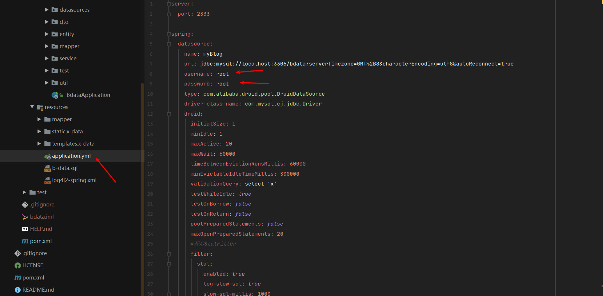
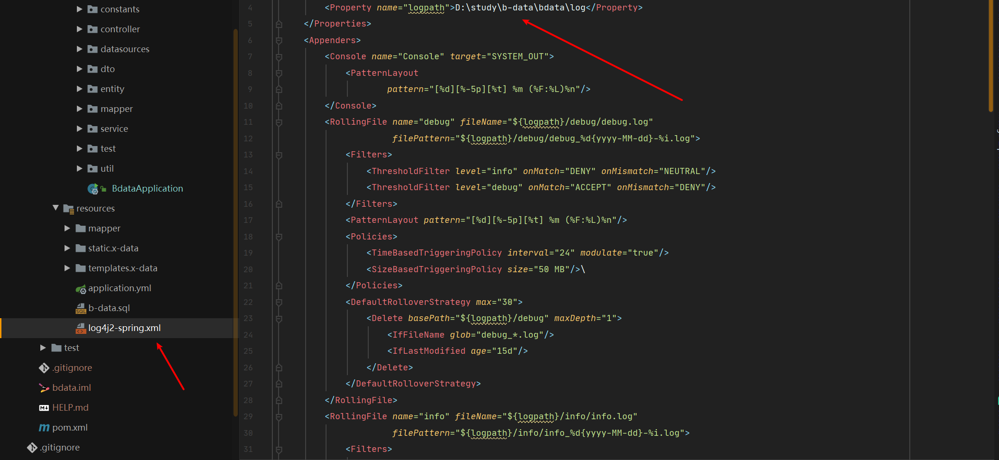
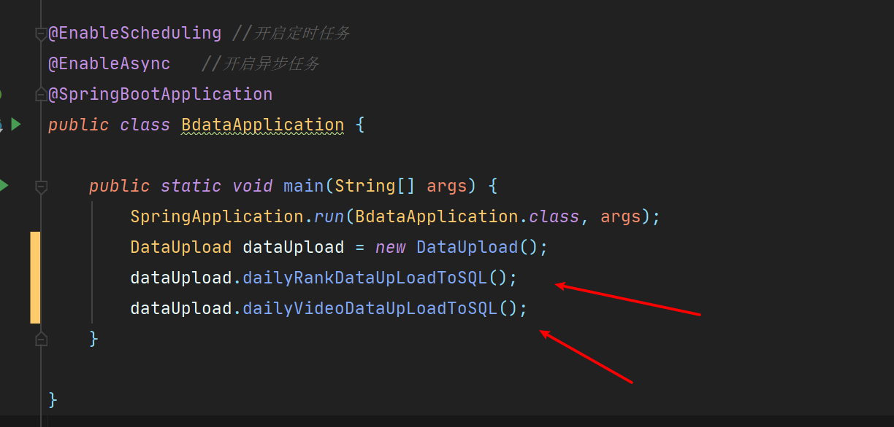
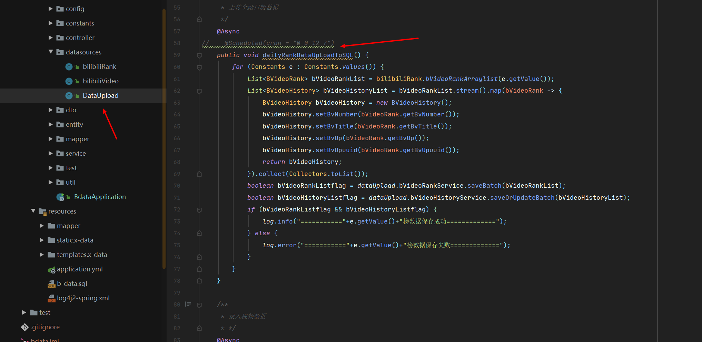
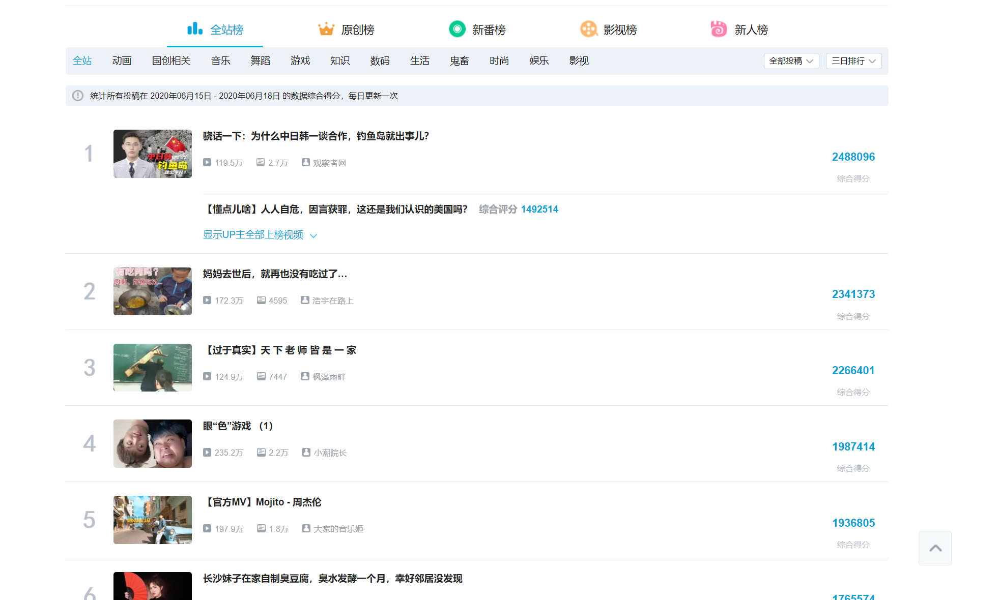
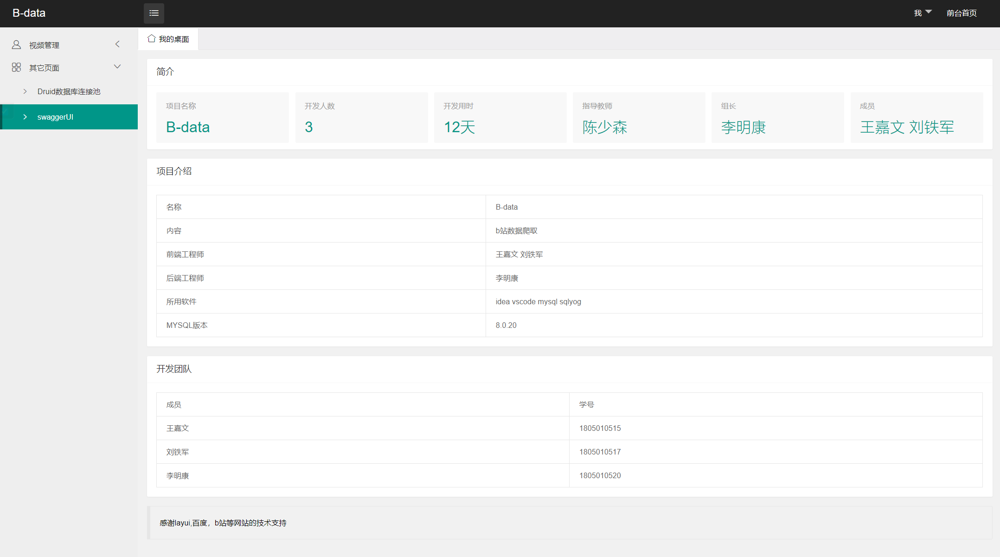
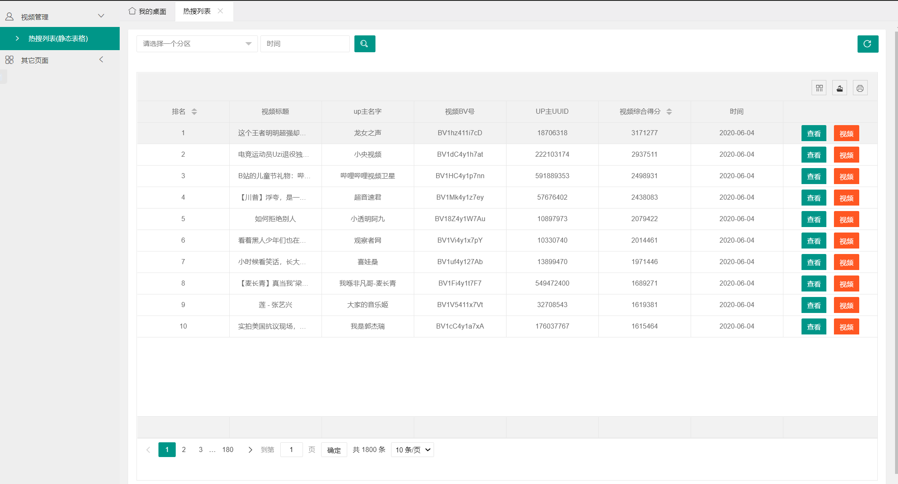
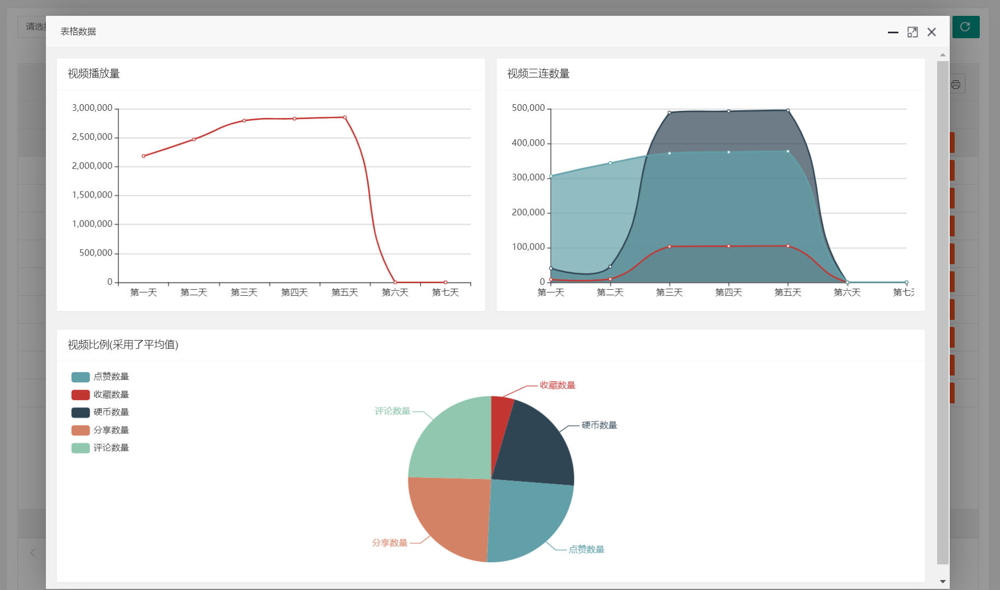
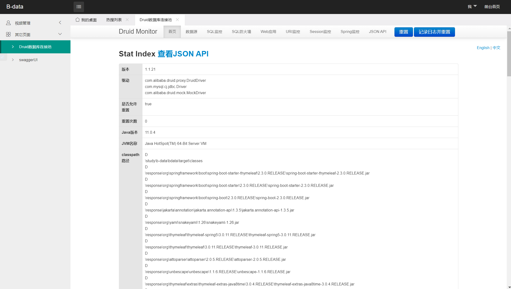
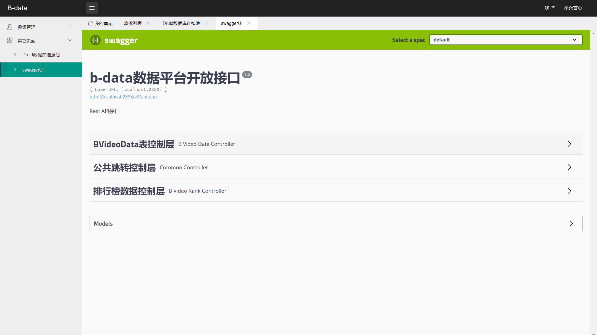

#B-data

#### 介绍

基于spring boot 2.1.6、mysql、hutool、jsoup、htmlunit、swagger2、mybatis-plus 、thymeleaf、layui bilibili数据爬取系统，数据全程 ajax 获取，封装 ajax 工具类、echart图表展示，数据交互都是以 JSON 格式交互。后台接口RESTful 风格，支持前后端分离。 

#### 软件架构

软件架构说明

* 核心框架：spring boot 2.1.6
* 持久层框架：mybatis-plus
* 数据库连接池：alibaba druid
* 日志框架：log4j
* 接口文档：swagger 2.9.2
* 前端模板：thymeleaf+layui2x
* 爬虫采用接口+jsoup
* 工具类Hutool
* 数据库MySQL

#### **部署**

- 下载项目 修改配置文件,将数据库账号密码修改为本地的,以及日志配置文件也是
- 
- 
- 导入b-data.sql,创建bdata数据库
- 启动项目后将会自动爬取数据(若不想爬取的话,可以将这两句代码注释,若有被注释导致无法跑出数据,请将它取消注释)
- 
- 若想开启定时任务可以将这个代码取消注释
- 
- 开启爬虫后请耐心等待几分钟(直到看到"全部数据保存成功"才算成功),爬虫暂时爬取的是全站榜,后续可以继续补充,爬取后面的排行榜)
- 
- 接口文档访问 http://localhost:2333/swagger-ui.html#/
- 登录地址 http://localhost:2333
- Druid账号为 admin 密码为123456

#### 效果展示

- 主页面

- 排行榜历史表格

- 表格视频数据

  

- 数据库连接池Druid

- 

- swagger-UI页面

